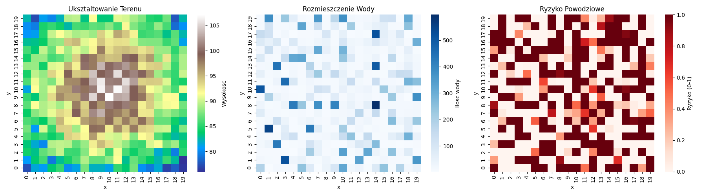

# River System Simulation & Flood Forecasting (C++20 & Python)

This project simulates river flow mechanics and flood phenomena on a 2D grid representing mountainous terrain. It leverages advanced **C++20** multithreading mechanisms (Barriers, Mutexes) for parallel processing of the terrain and includes a Python script for visualizing the results via Heatmaps.

## 🚀 Features
* **Multithreading:** Each row of the grid is processed by a dedicated thread (`std::thread`).
* **Synchronization:** Utilizes `std::barrier` for global iteration synchronization and `std::mutex` for thread-safe data access between neighboring rows.
* **Terrain Physics:** Simulates water flow to the lowest neighbors, accumulation in local depressions (lakes), snowmelt, and random rainfall.
* **Risk Analysis:** Calculates a flood risk coefficient (0.0 - 1.0) based on channel capacity.
* **Visualization:** Generates heatmaps for terrain height, water distribution, and flood risk using `matplotlib` and `seaborn`.

## Simulation Visualization

## 🛠️ Requirements

### C++ (Simulation Core)
* **Compiler:** Must support **C++20** (e.g., MSVC v143+, GCC 10+, Clang 11+).
* **OS:** Windows (Visual Studio) or Linux/macOS.

### Python (Visualization)
* Python 3.8+
* Libraries: `pandas`, `matplotlib`, `seaborn`

## ⚙️ Installation & Setup

### 1. Building the C++ Project

**Visual Studio (Windows)**
1.  Open the project in Visual Studio.
2.  Ensure the C++ Language Standard is set to **C++20**:
    * Go to `Project Properties` -> `C/C++` -> `Language` -> `C++ Language Standard`.
    * Select **ISO C++20 Standard (/std:c++20)**.
3.  Build and Run (`F5`).

